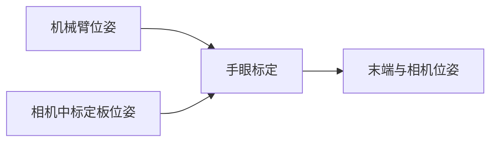

# 基于ROS的手眼标定程序包
## 概览
- 包含基础标定程序包，提供多组机器臂工具坐标和Marker坐标即可完成标定
- Marker基于ArTookie实现

>本程序包目前仅针对眼在手上的标定，通过输入两组以上的机械臂姿态信息(x,y,z,rx,ry,rz)和装在机械手上的相机所识别的标志物的姿态信息，经过程序计算可输出，机械臂末端和相机之间的坐标变换矩阵。



## 使用指南
### 1、基础使用
基础使用是在得到多组机械臂位姿与机械臂末端相机位姿之后直接使用本程序进行计算机械臂末端与相机之间的位姿关系。

- 机械臂位姿可以通过示教器或者SDK进行获取
  
- 相机中标定板位姿我们可以通过ArUco或者ArTookit等工具获得，可以参考这里。

> 我们使用一般读到的`（X,Y,Z,RX,RY,RZ）`六个数据表示

#### 安装测试
1. 下载编译
    ```
    git clone http://10.55.16.230/sangxin/handeye-calib.git
    cd handeye-calib
    catkin_make or catkin build
    ```
2. 修改base_hand_on_eye_calib.launch文件中，base_handeye_data参数为从机械臂位姿和标定板位姿所在的配置文件所在的绝对目录。
    ```
    <launch>
    <!-- you can see the example /home/sangxin/code/ros/work/handeye-calib/src/handeye-calib/config/base_hand_on_eye_test_data.csv  -->
    <arg  name="base_handeye_data"   default="The file path of handeye data." />
    <node pkg="handeye-calib" type="base_hand_on_eye_calib.py"      name="base_hand_on_eye_calib" output="screen" >
         <param name="base_handeye_data" value="$(arg base_handeye_data)" />
    </node>
    </launch>
    ```
3. 运行程序
    ```
    source devel/setup.bash
    roslaunch handeye-calib base_hand_on_eye_calib.launch
    ```

4. 查看结果
    程序会根据配置文件中的坐标进行计算，最终输出如下数据(单位毫米，弧度制)：
    ```
    [INFO] [1612332792.280545]: The Camera To Hand Matrix
    [[ 0.67778048 -0.73397949  0.04344798  0.10180987]
    [ 0.73514963  0.67753423 -0.02241383  0.05040806]
    [-0.0129862   0.04713243  0.99880423 -0.0038281 ]
    [ 0.          0.          0.          1.        ]]

    [INFO] [1612332792.284192]: The Camera To Hand 
    X,Y,Z:[[ 0.10180987  0.05040806 -0.0038281 ]]    
    RX,RY,RZ:(0.04715387459563979, 0.012986569559696204, 0.8259788402742381)

    [INFO] [1612332792.288997]: The CheckBoard1 in the base is:
    [[-0.99814102 -0.02938217  0.05339659 -0.39806312]
    [ 0.0290525  -0.9995538  -0.0069399   0.01683085]
    [ 0.05357667 -0.0053757   0.99854927  0.05607137]
    [ 0.          0.          0.          1.        ]]
    XYZ:[[-0.39806312  0.01683085  0.05607137]]
    ```

### 2、结合JAKA机械臂使用
待更新......

### 3、结合AUBO机械臂使用
待更新......

### 4、使用系统ArUco获取标定板位姿
- online:https://chev.me/arucogen/

### 5、使用ArTookit获取标定板位姿
待更新......

### 其他
#### 使用ROS usb_cam驱动相机：
##### 安装usbcam
Kinetic：
```
sudo apt-get install ros-kinetic-usb-cam
```
Melodic：
```
sudo apt-get install ros-melodic-usb-cam
```
#### 
```
roscd usb_cam
cd launch
sudo gedit usb_cam-test.launch 
```
```
<launch>
  <node name="usb_cam" pkg="usb_cam" type="usb_cam_node" output="screen" >
    <!-- modify the video device to your device -->
    <param name="video_device" value="/dev/video2" />
    <!-- modify the size of your device -->
    <param name="image_width" value="1280" />
    <param name="image_height" value="720" />
    <param name="pixel_format" value="yuyv" />
    <param name="camera_frame_id" value="usb_cam" />
    <param name="io_method" value="mmap"/>
  </node>
  <node name="image_view" pkg="image_view" type="image_view" respawn="false" ou$
    <remap from="image" to="/usb_cam/image_raw"/>
    <param name="autosize" value="true" />
  </node>
</launch>
```

```

```

#### 使用ROS进行相机标定
```
rosrun camera_calibration cameracalibrator.py --size 10x7 --square 0.015 image:=/usb_cam/image_raw camera:=/usb_cam
```

SAVE

```
<param name="camera_info_url" type="string" value="file:///home/dev/.ros/camera_info/ost.yaml"/>
```

## 版本日志
### V1.0
完成基础标定程序包，可以通过文件输出位姿进行，输出标定结果。并进行校验。

## 参考
- easy-handeye
- opencv-calibHandEye
- jaka&&aubo
- aruco_ros