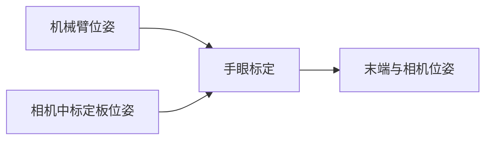

# 基于ROS的手眼标定程序包
## 概览
- 如果教程对你有帮助，可以start一下~
- 包含基础标定程序包，提供多组机器臂工具坐标和Marker坐标即可完成标定
- 包含JAKA、AUBO机械臂标定程序
- 本程序在`ros kinetic melodic`平台测试通过

>本程序包目前仅针对眼在手上的标定，通过输入两组以上的机械臂姿态信息(x,y,z,rx,ry,rz)和装在机械手上的相机所识别的标志物的姿态信息，经过程序计算可输出，机械臂末端和相机之间的坐标变换矩阵。



## 使用指南
### 1、基础使用
基础使用是在得到多组机械臂位姿与机械臂末端相机位姿之后直接使用本程序进行计算机械臂末端与相机之间的位姿关系。

- 机械臂位姿可以通过示教器或者SDK进行获取
  
- 相机中标定板位姿我们可以通过ArUco或者ArTookit等工具获得，可以参考这里。

> 我们使用一般读到的`（X,Y,Z,RX,RY,RZ）`六个数据表示

#### 安装测试


1. 下载编译
    ```
    git clone http://10.55.16.230/sangxin/handeye-calib.git
    cd handeye-calib
    catkin_make or catkin build
    ```
2. 修改base_hand_on_eye_calib.launch文件中，base_handeye_data参数为从机械臂位姿和标定板位姿所在的配置文件所在的绝对目录,可以使用launch文件的`find`。
    ```
    <launch>
      <!-- <arg   name="base_handeye_data"   default="The file path of handeye data." /> -->
      <arg   name="base_handeye_data"   default="$(find handeye-calib)/config/base_hand_on_eye_test_data.csv" />
      <node pkg="handeye-calib" type="base_hand_on_eye_calib.py" name="base_hand_on_eye_calib" output="screen" >
          <param name="base_handeye_data" value="$(arg base_handeye_data)" />
      </node>
    </launch>
    ```
3. 运行程序
    ```
    source devel/setup.bash
    roslaunch handeye-calib base_hand_on_eye_calib.launch
    ```

4. 查看结果
    程序会根据配置文件中的坐标进行计算，最终输出如下数据(单位毫米，弧度制)：
    ```
    [INFO] [1612332792.280545]: The Camera To Hand Matrix
    [[ 0.67778048 -0.73397949  0.04344798  0.10180987]
    [ 0.73514963  0.67753423 -0.02241383  0.05040806]
    [-0.0129862   0.04713243  0.99880423 -0.0038281 ]
    [ 0.          0.          0.          1.        ]]

    [INFO] [1612332792.284192]: The Camera To Hand 
    X,Y,Z:[[ 0.10180987  0.05040806 -0.0038281 ]]    
    RX,RY,RZ:(0.04715387459563979, 0.012986569559696204, 0.8259788402742381)

    [INFO] [1612332792.288997]: The CheckBoard1 in the base is:
    [[-0.99814102 -0.02938217  0.05339659 -0.39806312]
    [ 0.0290525  -0.9995538  -0.0069399   0.01683085]
    [ 0.05357667 -0.0053757   0.99854927  0.05607137]
    [ 0.          0.          0.          1.        ]]
    XYZ:[[-0.39806312  0.01683085  0.05607137]]
    ```

### 2、结合JAKA机械臂使用
- **jaka标定文件会自己订阅两个话题的数据**，一个是机械臂的位姿话题和相机中标定物的位姿话题。
- 机械臂的话题可以通过运行本仓库中的jaka_comuniate功能包中的jaka_comuniate.launch获得。
- 相机中标记物的姿态数据，可以参考本文第四节使用ArUco获取标定板位姿

#### 1.配置jaka机械臂ip地址信息

配置jaka_host参数为你的jaka机械臂所在的host，并确保你目前所使用的电脑能够`ping`通该ip。

运行该节点后将会发布`jaka_pose`话题。

```
<launch>
    <arg  name="jaka_host"   default="10.55.17.17" />
    <node pkg="jaka_comuniate" type="jaka_comuniate" name="jaka_comuniate" output="screen" >
         <param name="jaka_host" value="$(arg jaka_host)" />
    </node>
</launch>
```


#### 2.配置话题信息
主要配置参数有`jaka_pose_topic`、`camera_pose_topic`。分别代表jaka机械臂的通信地址和，相机中标记物的位姿话题。
  ```
  <launch>
    <!-- The arm tool Pose Topic,Use ros geometry_msgs::Pose-->
    <arg   name="jaka_pose_topic"   default="/jaka_pose" />
    <!-- The arm marker in camera Pose Topic,Use ros geometry_msgs::Pose-->
    <arg   name="camera_pose_topic"   default="/ar_pose_estimate/marker_to_camera" />

    
    <node pkg="handeye-calib" type="jaka_hand_on_eye_calib.py" name="jaka_hand_on_eye_calib" output="screen" >
         <param name="jaka_pose_topic" value="$(arg jaka_pose_topic)" />
         <param name="camera_pose_topic" value="$(arg camera_pose_topic)" />
    </node>
    
</launch>
  ```

#### 3.运行标定程序

```
source devel/setup.bash
roslaunch handeye-calib jaka_hand_on_eye_calib.launch
```

#### 4.开始标定


#### 5.生成参数


### 3、结合AUBO机械臂使用
#### 1.配置aubo机械臂ip地址信息

#### 2.配置运行aubo通信节点

#### 3.运行标定程序

#### 4.开始标定

#### 5.生成参数


### 4、使用系统ArUco获取标定板位姿
- 在线生成标定板:https://chev.me/arucogen/

1.安装

2.修改参数

3.开始运行


## 其他
### 1.、使用ROS usb_cam驱动相机：
#### a.安装usbcam
Kinetic：
```
sudo apt-get install ros-kinetic-usb-cam
```
Melodic：
```
sudo apt-get install ros-melodic-usb-cam
```
其他版本

```
sudo apt-get install ros-melodic-版本名称-cam
```

#### b.修改launch文件

进入目录：
```
roscd usb_cam
cd launch
sudo gedit usb_cam-test.launch 
```
目前主要修改device和width两个参数，可以使用`ls /dev/video*`查看系统视频设备。
```
<launch>
  <node name="usb_cam" pkg="usb_cam" type="usb_cam_node" output="screen" >
    <!-- modify the video device to your device -->
    <param name="video_device" value="/dev/video2" />
    <!-- modify the size of your device -->
    <param name="image_width" value="1280" />
    <param name="image_height" value="720" />
    <param name="pixel_format" value="yuyv" />
    <param name="camera_frame_id" value="usb_cam" />
    <param name="io_method" value="mmap"/>
  </node>
  <node name="image_view" pkg="image_view" type="image_view" respawn="false" ou$
    <remap from="image" to="/usb_cam/image_raw"/>
    <param name="autosize" value="true" />
  </node>
</launch>
```
#### c. 启动相机

```
roslaunch usb_cam usb_cam-test.launch
```

### 2、使用ROS进行相机标定
#### 1.使用ROS自带的标定程序进行标定。

- 小工具：棋盘格pdf在线生成网站：[点击打开](https://calib.io/pages/camera-calibration-pattern-generator),生成后使用一比一打印要比手动量的要精准哦。
- 标定完成后点击Save可以保存标定所用的图片和参数矩阵。在终端里会输出标定产生的压缩包，默认放在`/tmp`目录下。

##### a.运行标定程序

运行前需要根据你的棋盘格修改两个参数，一个是size参数为棋盘格角点数量比如8x9=72个格子的棋盘格，角点个数为7x8=63个，size参数就要写7x8。另外一个参数为square，传入的参数为棋盘格一个小格子的宽度（注意单位为m）。
```
rosrun camera_calibration cameracalibrator.py --size 10x7 --square 0.015 image:=/usb_cam/image_raw camera:=/usb_cam
```
##### b.生成标定文件  
标定完成后点击Calculate会稍微有点卡顿，不要担心后台正在进行标定，完成后下面的SAVE和COMMIT按钮变为可用状态，点击SAVE即可保存标定完成后的文件。

##### c.在ROS中使用该参数
可以在usb_cam的launch文件中增加以下参数，重新启动usb_cam节点，即可使用该标定参数。

```
<param name="camera_info_url" type="string" value="file:///home/dev/.ros/camera_info/ost.yaml"/>
```

## 版本日志

- V2.0
  添加配合aubo机械臂进行手眼标定程序。

- V1.5
  添加配合jaka机械臂进行手眼标定程序。

  

- V1.0
  完成基础标定程序包，可以通过文件输出位姿进行，输出标定结果。并进行校验。

## 贡献

- [@sangxin](sangxin@infore.com) InforeRobot
- [@duanxh](duanxh@infore.com) InforeRobot

## 参考
- easy-handeye
- opencv-calibHandEye
- jaka&&aubo
- aruco_ros
- [csdn](https://blog.csdn.net/sandy_wym_/article/details/83996479)